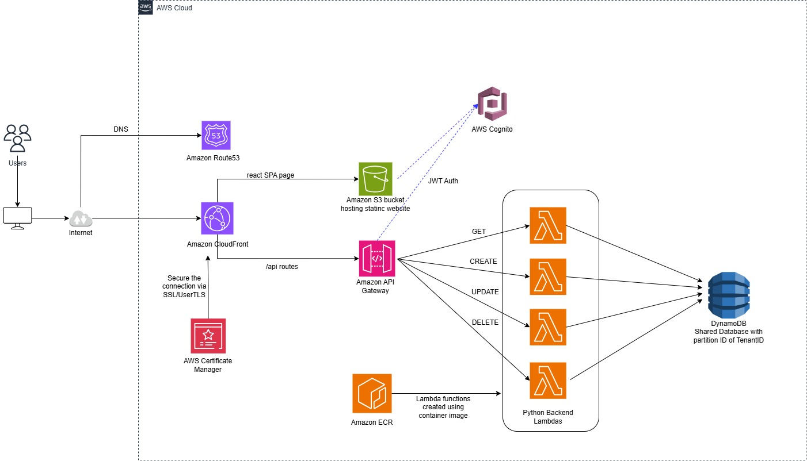

# Table of Contents

# Part 1 - SAAS Architecture for React frontend + Python backend application on AWS

A static React app hosted in an S3 bucket with a CloudFront distribution in front of the website. The backend is running behind API Gateway, implemented as a Lambda function. Here, the application is fully downloaded to the client and rendered in a web browser. It sends requests to the backend.

## Solution Steps
### 1️⃣ React Frontend – Host on S3 + CloudFront
1.  Create an Amazon S3 bucket and set it up for static website hosting Upload the react app. Use CloudFront Origin Access Control (OAC) instead of public bucket
   
2.  Create DNS records in Amazon Route53

3.  Set up an Amazon CloudFront distribution and link it with a custom domain
   
4.  Secure the connection via SSL/UsersTLS and AWS Certificate Manager

### 2️⃣ Python Backend – API Gateway + Lambda
1.  Create Lambda Function from container images in Amazon ECR

2.  Create API Gateway (HTTP API) and integrate with Lambda functions

3.  Connect React to Backend
      Option-1: React app in Browser → API Gateway → Lambda. CORS must be configured in API Gateway
      Option-2: Browser → CloudFront → API Gateway → Lambda. CloudFront Routes /api to API Gateway. Below architecture diagram depicts this solution.
   

## End-to-End Request Flow
1.  User loads site from **CloudFront**
    
2.  CloudFront pulls static files from **S3**
    
3.  React app makes HTTP request to **API Gateway**  [OR] CloudFront uses multiple origins and routes /api to API Gateway.
    
4.  API Gateway triggers **Lambda**
    
5.  Lambda queries database and returns JSON
    
6.  React updates UI

