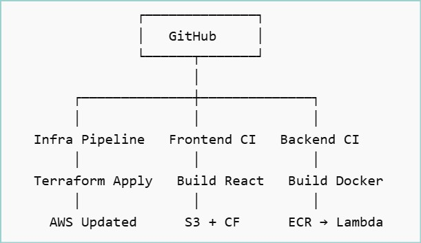

# Part 2: CICD Blueprint
Three CICD pipelines required.

2. CICD pipeline to maintain frontend react SPA - Every code push to remote repo will trigger pipeline to push the updated application to S3 bucket
3. CICD pipeline to maintain the - Every code push to remote repo will trigger pipeline to build a new docker images from updated python code, push to ECR repository, and re deploy the lambda functions with the new container.

**1️⃣ CI/CD Pipeline – Infrastructure (IaC → AWS)**
   
**Goal** : Every push to the infra repo updates AWS infrastructure automatically.

**Recommended Stack**:

- IaC Tool: Terraform

- CI/CD: AWS CodePipeline

- Build stage: AWS CodeBuild

- State storage (Terraform): S3

**Architecture Flow** : Git Push → CodePipeline → CodeBuild → terraform plan → manual approval (optional, but recommended for prod) → terraform apply → AWS updated

**2️⃣ CI/CD Pipeline – React SPA → S3**
   
**Goal** : Push to repo → Build React app → Deploy static files to S3

**Recommended Stack**:

-   Amazon S3
    
-   Amazon CloudFront
    
-   AWS CodePipeline
    
-   AWS CodeBuild

**Architecture Flow** : Git Push → CodePipeline → CodeBuild (npm build) → Upload to S3 → Invalidate CloudFront

**3️⃣ CI/CD Pipeline – Python → Docker → ECR → Lambda**
   
**Goal** : Push to repo with changed code → Build Docker image → Push to ECR → Update Lambda with new image

**Recommended Stack**:

- Amazon Elastic Container Registry

- AWS Lambda

- AWS CodeBuild

- AWS CodePipeline

**Architecture Flow** : Git Push → CodePipeline → CodeBuild (Docker build) → Push to ECR → Update Lambda image URI

# Complete CI/CD Architecture Overview

